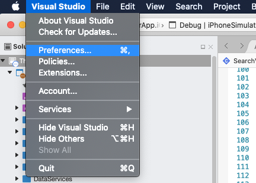
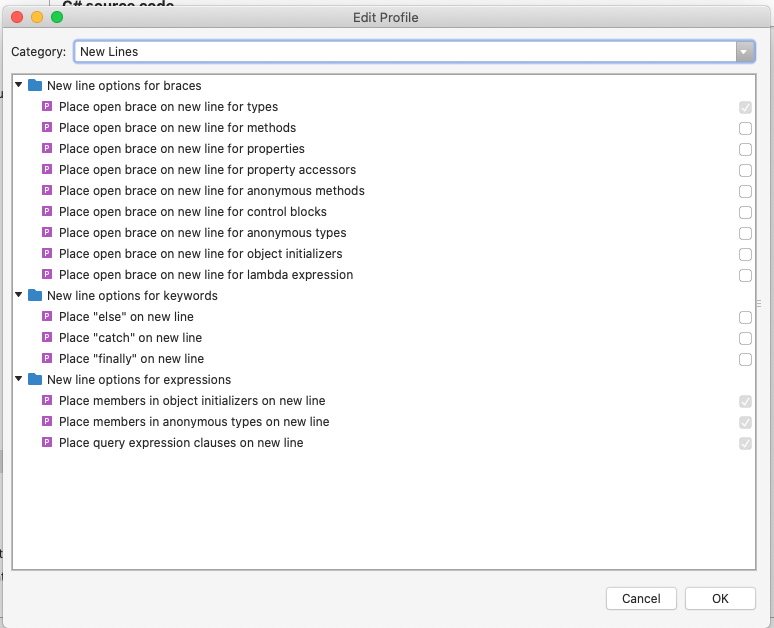

# Brace {} placement

Regarding [Aviva C# Guidelines v5.4.0](https://github.com/dennisdoomen/CSharpGuidelines/releases/tag/5.4.0) at item AV2400, all opening braces must be placed on a new line; however, at Naxam, we WONT' DO that as we try to make our source code compatible with Microsoft open source projects like Xamarin projects and DotNetCore projects. 

## DO

- Do place opening brace on the new line for class, interface, struct and enum declaration

```
class ClassA 
{
    // Class members
}
```

```
interface ISample 
{
    // Interface members
}
```

```
struct SampleStruct 
{
    // Struct members
}
```

```
enum Enum 
{
    // Enum members
}
```

- Do place openning brace on the same line for all other declrations


```
// full property declaration
string _PropertyName;
public string PropertyName {
    get => _PropertyName;
    set => _PropertyName = value;
}

// auto property declaration
public string PropertyName { get; set; }
```

```
// method declaration
public void DoSomething() {
    // Method implementation
}
```

```
do {
    // logic comes here
} while (true != false);
```

```
while (true != false) {
    // logic comes here
}
```

```
for (var i=0; i<100; i++) {
    // logic comes here
}
```

```
foreach (var item in collection) {
    // logic comes here
}
```

```
if (condition) {
    // logic comes here
} if else {
    // logic comes here
} else {
    // logic comes here
}
```

```
switch (value) {
    case noBlock:
        break;
    case block: {
        break;
    }
}
```

```
// type initialization
var student = new Student {

};
```

```
// anonymous method/lambda
task.ContinueWith(t => {

});
```

## Visual Studio Setup

### Visual Studio for Mac
1. Open VSfMac Preference pane



2. Set the rules
> Source Code > Code Formatting > C# source code > C# format > Edit > New Lines



### Visual Studio for Windows

> Tobe defined

