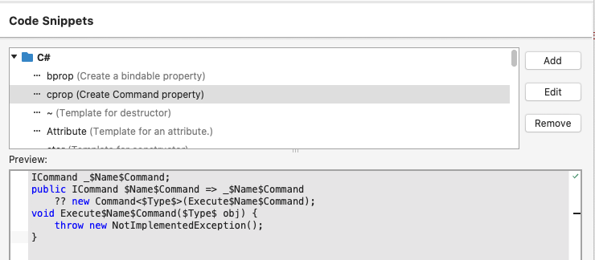

# MVVM Common Snippets
This contains snippets for base classes/common blocks using while developing .NET application using MVVM design pattern.

1. Base classes
    - [Without framework](#without-framework)
    - [With MvvmCross](#with-mvvmcross)
    - [With FreshMvvm](#with-freshmvvm)
    - [With Prism](#with-prism)
2. Common blocks

## Base classes
### Without framework
- ModelBase
```C#
namespace Naxam.Practices 
{
    using System.ComponentModel;
    using System.Runtime.CompilerServices;

    // Use PropertyChanged.Fody to simply property declaration
    [AddINotifyPropertyChangedInterface]
    public abstract class ModelBase : INotifyPropertyChanged
    {
        public event PropertyChangedEventHandler PropertyChanged;

        protected void RaisePropertyChanged([CallerMemberName]string propertyName = null) {
            PropertyChanged?.Invoke(this, new PropertyChangedEventArgs(propertyName));
        }

        protected void SetProperty<T>(ref T property, T newValue, [CallerMemberName]string propertyName = null) {
            if (Equals(property, newValue)) return;

            property = newValue;

            RaisePropertyChanged(propertyName);
        }
    }
}
```

- ViewModelBase
```C#
namespace Naxam.Practices 
{
    using System.ComponentModel;
    using System.Runtime.CompilerServices;

    // Use PropertyChanged.Fody to simply property declaration
    [AddINotifyPropertyChangedInterface]
    public abstract class ViewModelModelBase : ModelBase
    {
    }
}
```

### With MvvmCross
- ModelBase
```C#
namespace Naxam.Practices 
{
    using MvvmCross.Core.ViewModels;

    // Use PropertyChanged.Fody to simply property declaration
    [AddINotifyPropertyChangedInterface]
    public abstract class ModelBase : MvxNotifyPropertyChanged
    {
    }
}
```

- ViewModelBase
```C#
namespace Naxam.Practices 
{
    using MvvmCross.Core.ViewModels;

    // Use PropertyChanged.Fody to simply property declaration
    [AddINotifyPropertyChangedInterface]
    public abstract class ViewModelBase : MvxViewModel
    {
    }
}
```

### With FreshMvvm
- ModelBase
```C#
namespace Naxam.Practices 
{
    // Use PropertyChanged.Fody to simply property declaration
    [AddINotifyPropertyChangedInterface]
    public abstract class ModelBase
    {
    }
}
```

- ViewModelBase
```C#
namespace Naxam.Practices 
{
    using FreshMvvm;

    public abstract class ViewModelBase : FreshBasePageModel
    {
    }
}
```

### With Prism
- ModelBase
```C#
namespace Naxam.Practices 
{
    using Prism.Mvvm;

    public abstract class ModelBase : BindableBase
    {
    }
}
```

- ViewModelBase
```C#
namespace Naxam.Practices 
{
    using Prism;
    using Prism.Mvvm;
    using Prism.Navigation;

    public abstract class ViewModelBase : ModelBase, INavigationAware
    {
        public virtual void OnNavigatedFrom(NavigationParameters parameters) {
        }

        public virtual void OnNavigatedTo(NavigationParameters parameters) {
        }

        public virtual void OnNavigatingTo(NavigationParameters parameters) {
        }
    }

    public class EmbedableViewModelBase : ViewModelBase, IActiveAware, IDestructible
    {
        public event EventHandler IsActiveChanged;

        bool _IsActive;
        public bool IsActive {
            get => _IsActive;
            set {
                SetProperty(ref _IsActive, value, HandleIsActiveChanged);
            }
        }

        protected bool HasInitialized { get; set; }

        public virtual void OnActiveChanged(IsActiveChangedEventArgs args) {
        }
    
        public virtual void Destroy() {
        }

        void HandleIsActiveChanged() {
            OnActiveChanged(new IsActiveChangedEventArgs(IsActive));
            IsActiveChanged?.Invoke(this, new IsActiveChangedEventArgs(IsActive));
        }
    }

    public class IsActiveChangedEventArgs : EventArgs
    {
        public bool IsActive { get; private set; }

        public IsActiveChangedEventArgs(bool isActive) {
            IsActive = isActive;
        }
    }
}
```

## Common blocks
- `prop`, `propg` - must be modified to generate code in single line of code

- `cpropf` - Create new command property with both CanExecute and Execute methods
```C#
ICommand _$name$Command;
public ICommand $name$Command => _$name$Command 
    ??= new Command<$type$>(Execute$name$Command, CanExecute$name$Command); 
bool CanExecute$name$Command($type$ parameter) { return true; }
void Execute$name$Command($type$ parameter) {}
```

- `cprop` - Create new command property with only Execute method
```C#
ICommand _$name$Command;
public ICommand $name$Command => _$name$Command 
    ??= new Command<$type$>(Execute$name$Command); 
void Execute$name$Command($type$ parameter) {}
```

- `oprop` - Create new observable property
```C#
$type$ _$name$;
public $type$ $name$ {
    get => _$name$;
    set => SetProperty(ref _$name$, value);
}
```
*NOTE* Don't define `oprop` if we are using `PropertyChanged.Fody` package

- `bprop` - Creaet new bindable property
```c#
public static readonly BindableProperty $Name$Property = BindableProperty.Create(
    nameof($Name$),
    typeof($Type$),
    typeof($Class$),
    default($Type$),
    BindingMode.OneWay);
public $Type$ $Name$ {
    get => ($Type$)GetValue($Name$Property);
    set => SetValue($Name$Property, value);
}
```

- `aprop` - Creaet new attached property
```c#
public static readonly BindableProperty $Name$Property = BindableProperty.CreateAttached(
    nameof($Name$),
    typeof($Type$),
    typeof($Class$),
    default($Type$),
    BindingMode.OneWay);
public static $Type$ Get$Name$(BindableObject obj) => ($Type$)obj.GetValue($Name$Property);
public static void Set$Name$(BindableObject obj, $Type$ value)  => obj.SetValue($Name$Property, value);
```

## Visual Studio Configuration

### Visual Studio for Mac

1. Open VSfMac Preference pane


2. Add or Edit
> Text Editor > Code Snippets > Add (or Edit)



3. Snippet Editor


### Visual Studio for Windows

> Tobe defined