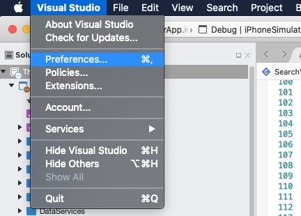

# XML/XAML Code formatting

## XML
- Each attribute is placed in a line
- All attritubes are left aligned
- First attribute is placed in a new line

## XAML
- Long binding expression must be splitted in multiple lines

## Visual Studio Settings

### Visual Studio for Mac
1. Open VSfMac Preference pane

2. Set the rules
> Source Code > Code Formatting > XML document > XML format

### Visual Studio for Windows

1. Open Visual Studio Tools Options window

2. Set the rules
